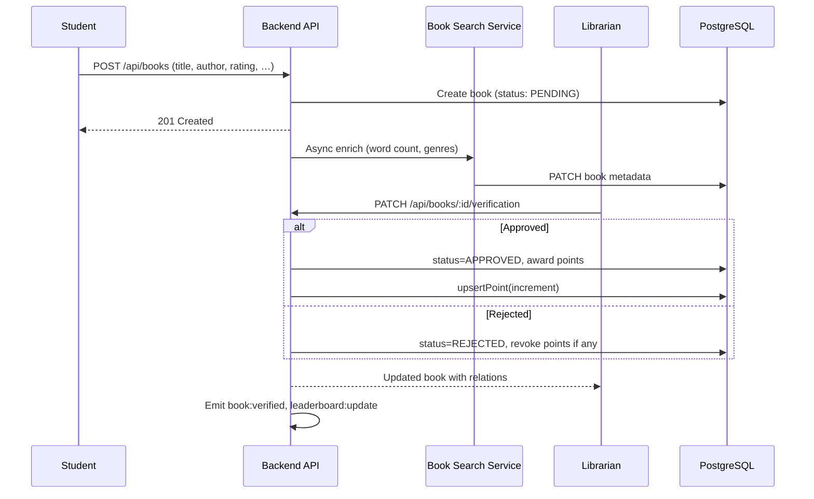
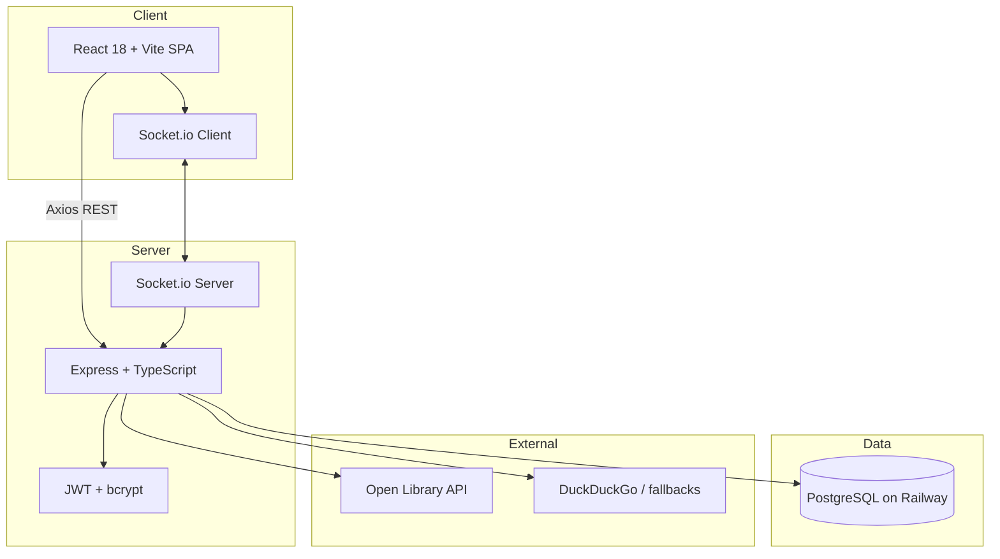
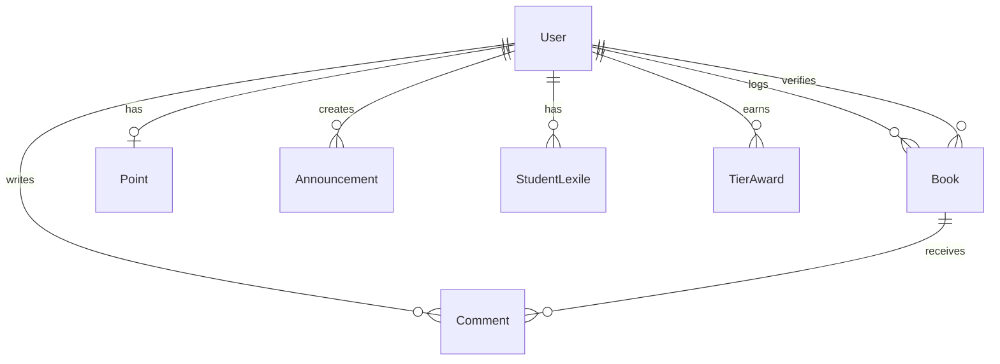

# Pageforge — Detailed Project Overview

**Pageforge** is a full-stack web application built for **St Peter's Prep School** (`@stpeters.co.za`). It tracks student reading, gamifies progress through a tier-based **Reading XP** system, and connects students, teachers, and librarians with dashboards, leaderboards, verification workflows, and real-time updates.

---

## Table of Contents

1. [Purpose & Goals](#purpose--goals)
2. [User Roles & Permissions](#user-roles--permissions)
3. [Core Workflows](#core-workflows)
4. [Points & Tier System](#points--tier-system)
5. [Feature Breakdown by Role](#feature-breakdown-by-role)
6. [Technical Architecture](#technical-architecture)
7. [Project Structure](#project-structure)
8. [Database Schema](#database-schema)
9. [Authentication & Authorization](#authentication--authorization)
10. [API Reference](#api-reference)
11. [Real-Time Events (Socket.io)](#real-time-events-socketio)
12. [External Integrations](#external-integrations)
13. [Frontend Routes & Components](#frontend-routes--components)
14. [Environment Variables](#environment-variables)
15. [Scripts & Development Commands](#scripts--development-commands)
16. [Deployment](#deployment)
17. [Related Documentation](#related-documentation)

---

## Purpose & Goals

| Goal | How Pageforge addresses it |
|------|----------------------------|
| Encourage reading | Gamified Reading XP, 9-tier progression, leaderboards, certificates |
| Measure reading | Book logs with Lexile levels, word counts, ratings, and comments |
| Teacher visibility | Grade/class-scoped dashboards, comments, and reactions |
| Librarian control | Verification, announcements, user management, Lexile bulk updates, analytics |
| School-wide engagement | School and grade leaderboards, announcements, competitive rankings |

Students log books they have read. Librarians **verify** submissions (approve or reject). On approval, students earn **Reading XP** based on how the book's Lexile level compares to their current reading level. Points unlock tiers from **Starter** through **Netherite (Apex)**.

---

## User Roles & Permissions

All users must use an `@stpeters.co.za` email address. Grades supported: **3–7**.

| Capability | Student | Teacher | Librarian |
|------------|:-------:|:---------:|:---------:|
| Sign up (email + password) | ✓ | — | — |
| Log in (email/password or legacy email-only) | ✓ | ✓ | ✓ |
| Log books | ✓ | — | ✓ (on behalf of student) |
| Edit/delete own pending books | ✓ | — | — |
| View own book logs & stats | ✓ | — | — |
| View class/grade book logs | — | ✓ | ✓ |
| View all school book logs | — | — | ✓ |
| Approve/reject book submissions | — | — | ✓ |
| Comment on book logs | — | ✓ | ✓ |
| React to comments | ✓ | ✓ | ✓ |
| View leaderboards | ✓ | ✓ | ✓ |
| Create/edit/delete announcements | — | — | ✓ |
| Adjust student points | — | — | ✓ |
| Manage student/teacher/librarian accounts | — | — | ✓ |
| Manage Lexile levels (individual + bulk) | — | — | ✓ |
| View tier analytics & issue tier awards | — | — | ✓ |
| Generate/view certificates | ✓ | — | — |

---

## Core Workflows

### Book logging lifecycle



1. **Submit** — Student (or librarian on behalf of a student) submits title, author, rating (1–5), optional comment, and optional metadata (Lexile, cover URL, etc.).
2. **Enrich** — Backend asynchronously queries Open Library (and fallbacks) for word count and genres.
3. **Pending** — Book awaits librarian verification.
4. **Verify** — Librarian approves or rejects with an optional note. Approval awards Reading XP; rejection removes previously awarded points if re-verifying.
5. **Display** — Approved books count toward stats, leaderboards, and tier progress.

### Student signup lifecycle

1. Student completes signup form (name, surname, grade, class, email, password, optional Lexile).
2. Backend validates `@stpeters.co.za` domain, creates `User` + `Point` (0 points).
3. If Lexile provided, syncs to `StudentLexile` for current academic term/year.
4. Returns JWT (7-day expiry); frontend stores in `localStorage` as `auth_token`.

### Academic term model

Terms are derived from the calendar (see `backend/src/lib/academic.ts`):

| Term | Months |
|------|--------|
| Term 1 | January – April |
| Term 2 | May – August |
| Term 3 | September – December |

Lexile history is stored per `(userId, term, year)`.

---

## Points & Tier System

### Reading XP calculation (on approval)

Points are awarded **only when a librarian approves** a book. The default calculation compares the book's Lexile level to the student's current Lexile:

| Condition | Points awarded |
|-----------|----------------|
| Book Lexile **above** student Lexile | **3** |
| Book Lexile **at level** (within 50L below student) | **2** |
| Book Lexile **below** level, or missing Lexile data | **1** |

Librarians may **override** points manually during approval. Re-approving with different points adjusts the student's total by the delta. Rejecting a previously approved book revokes awarded points.

> **Note:** Word count is tracked for statistics and leaderboards but is **not** the primary points formula. Historical migrations referenced words-based points; the current verification logic uses Lexile-based scoring.

### Tier thresholds (Reading XP)

Nine certificate tiers inspired by Minecraft materials. Thresholds are shared between `backend/src/lib/tiers.ts` and `frontend/src/lib/reading-tiers.ts`.

| Key | Name | Points required |
|-----|------|-----------------|
| — | **Starter** | Below 50 (no certificate tier) |
| `redstone` | Beginner | 50 |
| `copper` | Explorer | 60 |
| `emerald` | Guardian | 75 |
| `lapis` | Champion | 125 |
| `iron` | Master | 200 |
| `gold` | Hero | 400 |
| `diamond` | Legend | 800 |
| `obsidian` | Mythic | 1,200 |
| `netherite` | Apex | 2,000 |

**Tier awards** (`TierAward` table) let librarians formally record when a student reached a tier. Analytics derive tier reach dates from approved book history and support filtering by school, grade, or class.

---

## Feature Breakdown by Role

### Student dashboard (`/student/dashboard`)

- Personal book log with status badges (Pending / Approved / Rejected)
- Add/edit/delete books (pending only for edits)
- Reading XP total and tier progress bar
- Stats: books read, total words, average Lexile
- Lexile history with term/year tracking and trend indicators
- Points system explainer panel
- Certificate modal for tier achievements
- Announcement banner
- Link to **How to Log Reading** guide (`/student/how-to-log`)

### Teacher dashboard (`/teacher/dashboard`)

- Book logs filtered to students in the teacher's **grade + class**
- Search and filter (e.g. by rating)
- Comment modal for teacher feedback on logs
- Leaderboard for their context
- Announcements

### Librarian dashboard (`/librarian/dashboard`)

- **All books** tab — global log with grade/class/student filters and sorting
- **Verification** tab — pending queue with approve/reject modals
- **Verified by me** — books the librarian has processed
- Edit verification on approved books (adjust points, notes)
- Bulk book update/delete
- Announcements CRUD
- Library management modal (student/teacher/librarian accounts)
- Points adjustment
- Tier analytics and tier award management
- School-wide leaderboards

### Lexile management (`/librarian/lexile`)

- View class Lexile data by grade/class
- Set individual student Lexile per term
- Bulk update Lexile for an entire class

---

## Technical Architecture



### Tech stack

| Layer | Technologies |
|-------|-------------|
| **Frontend** | React 18, TypeScript, Vite 5, React Router 6, TailwindCSS 3, shadcn/ui (Radix), Framer Motion, Axios, Socket.io client, Lucide icons |
| **Backend** | Node.js, Express 4, TypeScript, JWT, bcrypt, Passport (Google OAuth strategy — see [Auth](#authentication--authorization)), pg (node-postgres), Socket.io 4 |
| **Database** | PostgreSQL (Railway) |
| **Monorepo** | npm workspaces (`frontend`, `backend`) |
| **Schema reference** | Prisma schema (`prisma/schema.prisma`, `backend/prisma/schema.prisma`) — migrations via SQL files; runtime queries use `pg` via `db-helpers.ts` |

### Key design decisions

- **Raw SQL via `pg`** — Prisma schema is reference-only; all queries go through parameterized helpers in `backend/src/lib/db-helpers.ts`.
- **JWT in Authorization header** — Frontend stores token in `localStorage`; Axios interceptor attaches `Bearer` token.
- **Role enforcement at route level** — `requireAuth`, `requireTeacher`, `requireLibrarian` middleware in `backend/src/middleware/auth.ts`.
- **Async book enrichment** — Book creation returns immediately; metadata search runs in background.
- **Consistent errors** — `{ message: string }` JSON shape via `AppError` + `errorHandler`.

---

## Project Structure

```
library/
├── frontend/                          # React SPA
│   ├── public/images/tiers/           # Tier badge artwork
│   └── src/
│       ├── components/                # Shared UI
│       │   ├── ui/                    # shadcn primitives (button, card, tabs, …)
│       │   ├── AnnouncementBanner.tsx
│       │   ├── ApproveBookModal.tsx
│       │   ├── BookCard.tsx
│       │   ├── BookLogTable.tsx
│       │   ├── EditVerifiedBookModal.tsx
│       │   ├── Leaderboard.tsx
│       │   ├── LibraryManagementModal.tsx
│       │   ├── PointsBadge.tsx
│       │   ├── PointsSystemPanel.tsx
│       │   └── ProtectedRoute.tsx
│       ├── contexts/
│       │   └── AuthContext.tsx        # User session state
│       ├── lib/
│       │   ├── api.ts                 # Axios instance + interceptors
│       │   ├── reading-tiers.ts       # Tier config + progress math
│       │   ├── socket.ts              # Socket.io singleton
│       │   └── utils.ts
│       └── pages/
│           ├── student/               # Dashboard, AddBookModal, CertificateModal, HowToLogReading
│           ├── teacher/                 # Dashboard, CommentModal
│           ├── librarian/               # Dashboard, LexileManagement
│           ├── Home.tsx, Login.tsx, SignUp.tsx, Info.tsx, AuthCallback.tsx
│           └── App.tsx                  # Route definitions
│
├── backend/
│   ├── src/
│   │   ├── server.ts                  # Express + Socket.io entry
│   │   ├── routes/                    # REST handlers
│   │   │   ├── auth.ts
│   │   │   ├── books.ts
│   │   │   ├── comments.ts
│   │   │   ├── announcements.ts
│   │   │   ├── points.ts
│   │   │   ├── leaderboard.ts
│   │   │   ├── lexile.ts
│   │   │   ├── users.ts
│   │   │   ├── admin.ts
│   │   │   └── analytics.ts
│   │   ├── middleware/
│   │   │   ├── auth.ts
│   │   │   ├── errorHandler.ts
│   │   │   └── logger.ts
│   │   ├── auth/
│   │   │   └── passport.ts            # Google OAuth strategy (optional)
│   │   ├── lib/
│   │   │   ├── db.ts                  # pg Pool
│   │   │   ├── db-helpers.ts          # All DB operations
│   │   │   ├── academic.ts            # Term/year helpers
│   │   │   └── tiers.ts               # Server-side tier logic
│   │   ├── services/
│   │   │   └── bookSearch.ts          # Open Library + fallbacks
│   │   └── types/
│   │       ├── database.ts            # TS types aligned with schema
│   │       └── express.d.ts
│   ├── prisma/
│   │   ├── schema.prisma
│   │   └── migrations/                # SQL migration files
│   └── scripts/                       # clear-books, backfill-lexile, …
│
├── prisma/schema.prisma               # Root schema reference (duplicate)
├── scripts/seed.ts                    # Dev/test data seeder
├── package.json                       # Workspace root scripts
├── README.md
├── DEPLOYMENT.md
├── GOOGLE_OAUTH_SETUP.md
├── PRODUCTION_READY.md
└── OVERVIEW.md                        # This file
```

---

## Database Schema

### Entity relationship summary



### Models

| Model | Purpose | Key fields |
|-------|---------|------------|
| **User** | All accounts | `email`, `name`, `surname`, `passwordHash`, `role`, `grade`, `class`, `lexileLevel`, `googleId` |
| **Book** | Reading log | `title`, `author`, `rating`, `comment`, `lexileLevel`, `wordCount`, `genres[]`, `coverUrl`, `status`, `verificationNote`, `verifiedAt`, `verifiedById`, `pointsAwarded`, `pointsAwardedValue` |
| **Point** | Student XP total | `userId` (unique), `totalPoints` |
| **Comment** | Teacher feedback | `content`, `bookId`, `teacherId`, `reactions` |
| **Announcement** | School messages | `message`, `createdBy` |
| **StudentLexile** | Term Lexile history | `userId`, `term`, `year`, `lexile` — unique on `(userId, term, year)` |
| **TierAward** | Formal tier certificates | `userId`, `tierKey`, `awardedAt`, `awardedById` — unique on `(userId, tierKey)` |

### Enums

- **Role:** `STUDENT` | `TEACHER` | `LIBRARIAN`
- **BookStatus:** `PENDING` | `APPROVED` | `REJECTED`

TypeScript types live in `backend/src/types/database.ts`.

---

## Authentication & Authorization

### Primary auth flow (current)

| Method | Endpoint | Notes |
|--------|----------|-------|
| Student signup | `POST /auth/signup` | bcrypt password, creates user + 0 points |
| Login | `POST /auth/login` | Password required if `passwordHash` set; legacy users without password can log in with email only |
| Current user | `GET /auth/me` | Requires JWT |
| Logout | `POST /auth/logout` | Client clears token |

JWT payload: `{ userId, email, role }` — **7-day expiry**.

Frontend: token stored in `localStorage` (`auth_token`); `api.ts` interceptor adds `Authorization: Bearer …`; 401 responses redirect to home.

### Google OAuth (infrastructure present)

`backend/src/auth/passport.ts` defines a Google OAuth 2.0 strategy restricted to `@stpeters.co.za`. Passport is a dependency and the strategy auto-creates users as `STUDENT` with 0 points. **OAuth routes are not currently mounted in `server.ts`** — the live login UI uses email/password. See [GOOGLE_OAUTH_SETUP.md](./GOOGLE_OAUTH_SETUP.md) to enable OAuth if desired.

### Route-level authorization patterns

- **Students** — own books and points only; teachers scoped by matching `grade` + `class`
- **Teachers** — `requireTeacher` for comments; read books for their class
- **Librarians** — `requireLibrarian` for verification, admin, analytics, announcements write, points adjust

---

## API Reference

Base URL: `http://localhost:3001` (dev) or Railway backend URL (prod).

All `/api/*` routes require `Authorization: Bearer <token>` unless noted.

### Health

| Method | Path | Auth | Description |
|--------|------|------|-------------|
| GET | `/health` | No | `{ status: 'ok', timestamp }` |

### Authentication (`/auth`)

| Method | Path | Auth | Description |
|--------|------|------|-------------|
| POST | `/auth/signup` | No | Student registration |
| POST | `/auth/login` | No | Email/password or legacy email login |
| GET | `/auth/me` | Yes | Current user profile |
| POST | `/auth/logout` | No | Logout acknowledgment |

### Books (`/api/books`)

| Method | Path | Role | Description |
|--------|------|------|-------------|
| GET | `/api/books` | All | List books (role-scoped filters: `userId`, `grade`, `class`, `status`, `sortBy`, `order`, `verifiedByMe`) |
| GET | `/api/books/:id` | All | Single book with relations |
| POST | `/api/books` | Student, Librarian | Log book (librarian may pass `userId`) |
| PUT | `/api/books/:id` | Owner / Librarian | Update book |
| DELETE | `/api/books/:id` | Owner / Librarian | Delete book |
| PATCH | `/api/books/:id/verification` | Librarian | Approve/reject; award/revoke points |
| PATCH | `/api/books/bulk` | Librarian | Bulk update |
| DELETE | `/api/books/bulk` | Librarian | Bulk delete |

### Leaderboards (`/api/leaderboard`)

| Method | Path | Description |
|--------|------|-------------|
| GET | `/api/leaderboard/by-grade?grade=` | Top readers in a grade |
| GET | `/api/leaderboard/school` | School-wide rankings |
| GET | `/api/leaderboard/words` | Most words read |
| GET | `/api/leaderboard/lexile` | Highest average Lexile |

### Comments (`/api/comments`)

| Method | Path | Role | Description |
|--------|------|------|-------------|
| GET | `/api/comments/:bookId` | All | Comments for a book |
| POST | `/api/comments` | Teacher, Librarian | Add comment |
| PUT | `/api/comments/:id/react` | All | Increment reaction count |
| DELETE | `/api/comments/:id` | Author / Librarian | Delete comment |

### Announcements (`/api/announcements`)

| Method | Path | Role | Description |
|--------|------|------|-------------|
| GET | `/api/announcements` | All | List announcements |
| POST | `/api/announcements` | Librarian | Create |
| PUT | `/api/announcements/:id` | Librarian | Update |
| DELETE | `/api/announcements/:id` | Librarian | Delete |

### Points (`/api/points`)

| Method | Path | Role | Description |
|--------|------|------|-------------|
| GET | `/api/points/:userId` | All (scoped) | User point total |
| POST | `/api/points/adjust` | Librarian | Manual point adjustment |

### Lexile (`/api/lexile`)

| Method | Path | Role | Description |
|--------|------|------|-------------|
| GET | `/api/lexile/student/:userId` | All (scoped) | Lexile history + current |
| POST | `/api/lexile/student/:userId` | Librarian | Set student Lexile for term |
| POST | `/api/lexile/bulk` | Librarian | Bulk class update |
| GET | `/api/lexile/class` | All | Class Lexile roster |

### Users (`/api/users`)

| Method | Path | Description |
|--------|------|-------------|
| GET | `/api/users/me` | Current user (alternate) |
| GET | `/api/users/:id/stats` | Reading stats (books, words, avg Lexile) |

### Admin (`/api/admin`) — Librarian only

| Method | Path | Description |
|--------|------|-------------|
| GET/POST | `/api/admin/students` | List / create students |
| PUT | `/api/admin/students/:id` | Update student |
| PATCH | `/api/admin/students/bulk` | Bulk update |
| DELETE | `/api/admin/students/:id` | Delete student |
| DELETE | `/api/admin/students/bulk` | Bulk delete |
| GET/POST/PUT/DELETE | `/api/admin/teachers` | Teacher CRUD |
| GET/POST/PUT | `/api/admin/librarians` | Librarian CRUD |
| POST | `/api/admin/librarians/password` | Set librarian password |

### Analytics (`/api/analytics`) — Librarian only

| Method | Path | Description |
|--------|------|-------------|
| GET | `/api/analytics/tier-breakdown?groupBy=&tier=` | Tier distribution by school/grade/class |
| PATCH | `/api/analytics/tier-award` | Record or revoke tier award |

---

## Real-Time Events (Socket.io)

Socket connects to the same host as the API (`VITE_API_URL`). Events are broadcast globally (no rooms).

| Event | Emitted when | Payload (approx.) | Frontend listener |
|-------|--------------|-------------------|-------------------|
| `book:logged` | New book created | `{ bookId, userId }` | — |
| `book:verified` | Book approved/rejected | `{ bookId, status }` | — |
| `leaderboard:update` | Book CRUD, verification, point adjust | — | `Leaderboard.tsx` refetches |
| `announcement:new` | Announcement created | announcement object | — |

Initialize via `frontend/src/lib/socket.ts` (`initSocket` / `getSocket`).

---

## External Integrations

### Book metadata search (`backend/src/services/bookSearch.ts`)

When a book is logged, the backend asynchronously searches for metadata:

1. **Open Library API** — primary source for page counts (→ estimated word count) and subjects/genres
2. **Fallback sources** — DuckDuckGo and additional heuristics if Open Library lacks data

Results update the book record in the background without blocking the create response.

---

## Frontend Routes & Components

### Routes (`App.tsx`)

| Path | Component | Access |
|------|-----------|--------|
| `/` | Home | Public |
| `/info` | Info | Public |
| `/login` | Login | Public |
| `/signup` | SignUp | Public |
| `/auth/callback` | AuthCallback | Public |
| `/student/dashboard` | StudentDashboard | STUDENT |
| `/student/how-to-log` | HowToLogReading | STUDENT |
| `/teacher/dashboard` | TeacherDashboard | TEACHER |
| `/librarian/dashboard` | LibrarianDashboard | LIBRARIAN |
| `/librarian` | LibrarianDashboard | LIBRARIAN |
| `/librarian/lexile` | LexileManagement | LIBRARIAN |

`ProtectedRoute` redirects unauthenticated users and enforces `allowedRoles`.

### Design system

| Token | Value |
|-------|-------|
| Primary | Coral `#FF6B6B` |
| Secondary | Sunny Gold `#FBBF24` |
| Accent | Sky Blue `#38BDF8` |
| Font | Nunito |
| Style | Rounded cards (`rounded-2xl`), warm gradients, Framer Motion for banners/modals |

Mobile-first layouts; dense tables avoided on small screens where possible.

---

## Environment Variables

### Backend (`backend/.env`)

```env
DATABASE_URL=postgresql://...
PORT=3001
NODE_ENV=development

# Optional — for Google OAuth if routes are mounted
GOOGLE_CLIENT_ID=
GOOGLE_CLIENT_SECRET=
GOOGLE_CALLBACK_URL=http://localhost:3001/auth/google/callback

JWT_SECRET=           # Required
SESSION_SECRET=       # For Passport sessions if OAuth enabled

FRONTEND_URL=http://localhost:5173
```

### Frontend (`frontend/.env`)

```env
VITE_API_URL=http://localhost:3001
```

---

## Scripts & Development Commands

Run from repository root:

| Command | Description |
|---------|-------------|
| `npm install` | Install all workspace dependencies |
| `npm run dev` | Start backend + frontend concurrently |
| `npm run dev:frontend` | Vite dev server (port 5173) |
| `npm run dev:backend` | tsx watch backend (port 3001) |
| `npm run build` | Build backend + frontend |
| `npm run seed` | Seed test users, books, announcements |
| `npm run clear-books` | Remove all book records |
| `npm run backfill-lexile` | Backfill StudentLexile from user.lexileLevel |
| `npm start` | Run production backend |

### Seed data

Creates 1 librarian, 2 teachers, 30 students (grades 3–7, classes A & B), sample books, comments, and announcements.

Example logins:
- Librarian: `librarian@stpeters.co.za`
- Teacher: `teacher1@stpeters.co.za` (Grade 3A)
- Student: `student3a1@stpeters.co.za` (Grade 3A)

---

## Deployment

Production runs on **Railway** with three services: PostgreSQL, backend API, and frontend static build.

| Resource | URL (example) |
|----------|---------------|
| Frontend | https://librarytracker.up.railway.app |
| Backend | https://librarytracker-backend.up.railway.app |

See [DEPLOYMENT.md](./DEPLOYMENT.md) and [RAILWAY_DEPLOY_STEPS.md](./RAILWAY_DEPLOY_STEPS.md) for full instructions. [PRODUCTION_READY.md](./PRODUCTION_READY.md) lists live URLs and test credentials.

---

## Related Documentation

| Document | Contents |
|----------|----------|
| [README.md](./README.md) | Quick start, setup, basic API list |
| [DEPLOYMENT.md](./DEPLOYMENT.md) | Railway deployment guide |
| [GOOGLE_OAUTH_SETUP.md](./GOOGLE_OAUTH_SETUP.md) | Google Cloud OAuth configuration |
| [PRODUCTION_READY.md](./PRODUCTION_READY.md) | Production status and test accounts |
| [SECURITY-REVIEW.md](./SECURITY-REVIEW.md) | Security review notes |
| [prisma/schema.prisma](./prisma/schema.prisma) | Database schema reference |
| [.cursor/rules/st-peters-library-standards.mdc](./.cursor/rules/st-peters-library-standards.mdc) | Agent/coding conventions for this repo |

---

## Summary

Pageforge is a **gamified reading tracker** for St Peter's Prep School. Students log books and earn Lexile-based Reading XP after librarian verification. A 9-tier progression system, multiple leaderboards, Lexile tracking, teacher comments, and librarian admin tools work together with Socket.io real-time updates. The codebase is a TypeScript monorepo (React + Express + PostgreSQL) deployed on Railway, with parameterized SQL via `db-helpers.ts` and a Prisma schema kept for reference and migrations.
